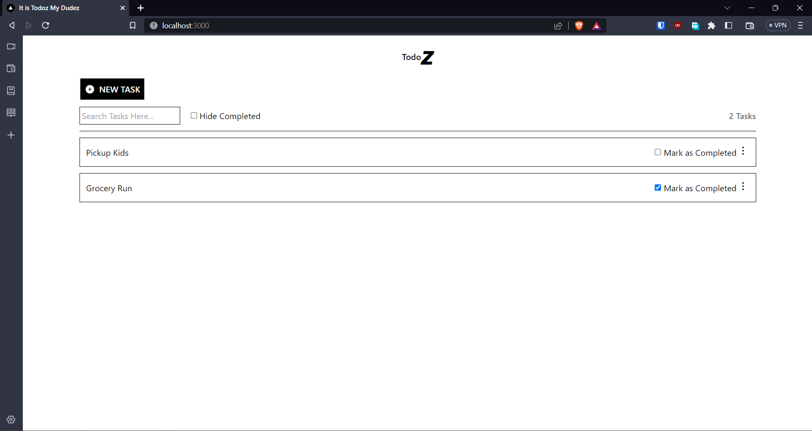

# TodoZ

> Just like the repository title, It is TodoZ My Dudes.

## Table of Contents

-   [Technologies Used](#technologies-used)
-   [Screenshots](#screenshots)
-   [Setup](#setup)
-   [Usage](#usage)
-   [Project Status](#project-status)
-   [Contact](#contact)
-   [License](#license)

## Technologies Used

-   NextJS
-   Prisma
-   TailwindCSS

## Screenshots



<!-- If you have screenshots you'd like to share, include them here. -->

## Setup

This project require

-   [Node.js](https://nodejs.org/)
-   PostgreSQL (you can change according to your liking)

## Usage

-   Install packages

```
npm install
```

-   Change database connection in .env file file
-   Migrate prisma scheme

```
npx prisma migrate dev
```

-   Run in development

```
npm run dev
```

## Project Status

Project is: _complete_

## Contact

Created by [@al-gilang-p](https://portoforme.vercel.app/) - feel free to contact me!

<!-- Optional -->

## License

MIT

<!-- You don't have to include all sections - just the one's relevant to your project -->
